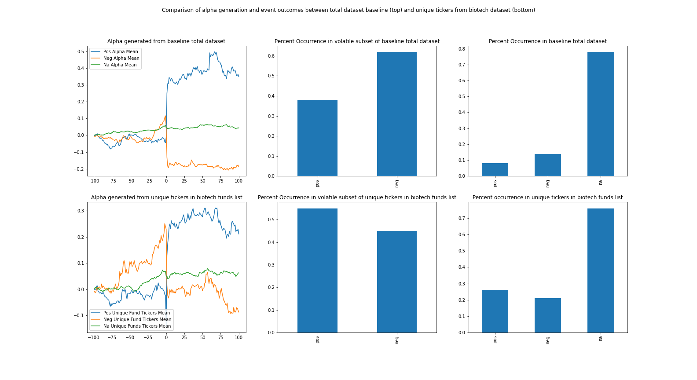

# biopharm_catalyst_project
*the goal of this project is to determine how biotech hedge fund form 13s can inform catalyst event outcomes*

## Results
The primary findings of the analysis was a significant statistical increase in positive event outcome occurence in tickers drawn from biotech hedge fund form 13s when compared to a baseline. The negative alpha attributed to negative outcome events was also less compared to the baseline. These findings support the hypothesis that biotech fund 13s can aid in determining the likely event outcome for specific catalysts.

## Notes
The project is written in a jupyter notebook. The kernel can be restarted to recreate the findings; the figures below the abstract require the data generated later in the code and should be run last. This is the only consideration when running the kernel. Risk free rate (Rf) is assumed to be zero when calculating alpha and beta. Alpha is calculated by subtracting expected return from actual return. Expected Return is calculated using Capital Asset Pricing Model where Rf equals 0. XBI was used as an index for better relevance as all the stocks belong to the biotech sector. Results of SPX or SPY as an index, associated beta, and direct comparison of XBI vs SPY as an index is shown at end of the notebook.  
